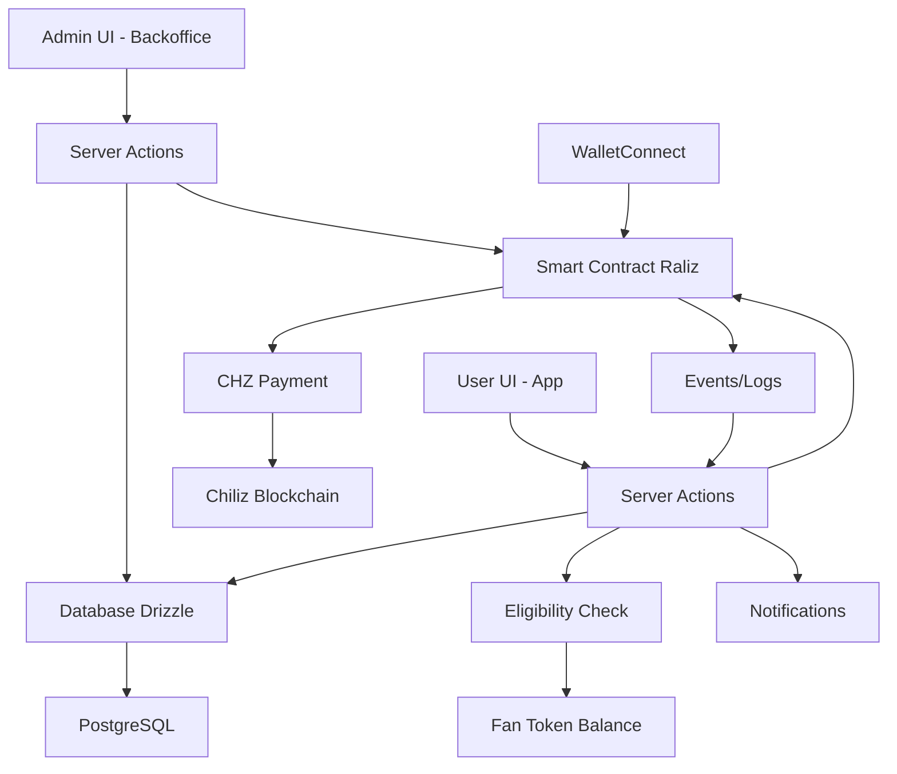

# 🎟️ Raliz – Jeux concours Web3 sur la blockchain Chiliz

## 🎯 Objectif du projet

**Raliz** permet aux organisateurs (clubs de sport, marques, artistes) de lancer des **raffles** (jeux concours) sur la **blockchain Chiliz**. Les utilisateurs participent avec leur wallet pour tenter de **gagner des lots exclusifs** (maillots, tickets VIP, NFT, etc.).

> Un raffle peut avoir plusieurs gagnants définis par l'organisateur. Le processus est transparent, auditable et immuable grâce à la blockchain.
> 

---

## 🧩 Fonctionnalités clés

- ✅ Création de raffles par un admin
- 💰 **Participation payante en CHZ** avec **condition de détention de fan tokens**
- 🎫 **Système d'éligibilité** : détenir minimum 50 fan tokens du sponsor
- 🎲 Sélection aléatoire de plusieurs gagnants
- 🔗 Intégration facile sur mobile et desktop

---

## 🛠️ Stack technique

| Élément | Tech |
| --- | --- |
| **Architecture** | Monorepo (Turborepo) |
| **Frontend** | Next.js 15 + TypeScript |
| **UI Components** | Shadcn/ui + Tailwind CSS |
| **Auth** | NextAuth.js (email) + WalletConnect | TO BE DEFINED
| **Database** | PostgreSQL + Prisma ORM |
| **Blockchain** | Chiliz Chain Testnet (EVM compatible) |
| **Smart Contracts** | Solidity + Hardhat |
| **Paiements** | **CHZ (token natif)** + Condition fan tokens |
| **RNG** | Math.random() + Manuel admin |
| **Déploiement** | Vercel + Railway |

### 🏗️ Architecture Monorepo
```
raliz/
├── apps/
│   ├── app/              # App utilisateur (Next.js)
│   └── backoffice/       # Backoffice organisateurs  (Next.js)
├── packages/
│   ├── ui/               # Composants Shadcn partagés
│   ├── db/               # Schema Drizzle + migrations
│   ├── contracts/        # Smart contracts Solidity + Hardhat
│   ├── auth/             # Configuration authentication
│   └── config/           # Config ESLint, TS, Tailwind
└── packages.json         # Turborepo setup
```

---

## 🔄 User Flow

### 👤 Côté Utilisateur

1. **Inscription** : Création compte avec email/mdp (NextAuth) TO BE DEFINED
2. **Découverte** : Browse les raffles disponibles (guest ok)
3. **Connexion Wallet** : Obligatoire pour participer (WalletConnect)
4. **Vérification d'éligibilité** : Détenir ≥ 50 fan tokens du sponsor
5. **Participation** : Paye en CHZ (token natif Chiliz)
6. **Suivi** : Reçoit notifications par email + in-app
7. **Gain** : Contacté par l'organisateur si gagnant

### 🛠️ Côté Organisateur (Ex: PSG)

1. **Auth Admin** : Connexion backoffice avec credentials
2. **Setup Fan Token** : Configure le fan token requis (PSG Token, etc.)
3. **Création Raffle** : Titre, lot, prix en CHZ, fan token requis, durée
4. **Monitoring** : Suit les participations en temps réel
5. **Tirage** : Lance manuellement après `endDate`
6. **Contact** : Récupère emails des gagnants pour distribution

### 💰 Nouveau Système de Participation

**🔄 Changement majeur :**
- **Paiement** : CHZ (token natif) au lieu des fan tokens
- **Condition** : Détenir minimum 50 fan tokens du sponsor
- **Vérification** : Check automatique de la balance avant participation

**Exemples concrets :**
- **PSG Raffle** → Détenir ≥ 50 `$PSG` tokens + Payer 0.1 CHZ
- **FC Barcelona** → Détenir ≥ 50 `$BAR` tokens + Payer 0.1 CHZ
- **Manchester City** → Détenir ≥ 50 `$CITY` tokens + Payer 0.1 CHZ

**Avantages :**
- ✅ **Simplicité** : Un seul token pour tous les paiements (CHZ)
- ✅ **Engagement** : Obligation de détenir les fan tokens du sponsor
- ✅ **Liquidité** : Pas de transfert de fan tokens nécessaire
- ✅ **Barrier d'entrée** : Évite le spam tout en gardant l'accessibilité

## 📱 Organisation des Pages

### 🌐 App Utilisateur (`/apps/app/`)

```
Pages principales :
├── / (homepage)           # Landing + liste raffles publics
├── /auth/login           # Connexion email/mdp
├── /auth/register        # Inscription
├── /raffles              # Liste complète raffles
├── /raffle/[id]          # Détail raffle + participation
├── /profile              # Profil + wallet connect
├── /my-participations    # Historique participations
└── /notifications        # Centre notifications
```

### ⚙️ Backoffice Admin (`/apps/backoffice/`)

```
Dashboard organisateur :
├── /admin                # Dashboard overview
├── /admin/raffles        # Gestion raffles
├── /admin/raffle/create  # Création raffle
├── /admin/raffle/[id]    # Détail + tirage gagnants
├── /admin/participants   # Vue participants
├── /admin/winners        # Gestion gagnants
├── /admin/settings       # Config fan token
└── /admin/analytics      # Stats participations
```

**Fonctionnalités admin :**
- 📊 Dashboard temps réel
- 🎲 Interface tirage gagnants
- 📧 Export emails gagnants
- 🏆 Gestion des lots
- 🎫 Config fan tokens requis

---

## 🧱 Modèle de données (MCD)

### Entités principales

**USER**
```
├── id (PK)
├── email
├── username
├── wallet_address (UK)
├── auth_provider (email|github|google)
├── is_verified
├── created_at
├── updated_at
```

**ORGANIZER**
```
├── id (PK)
├── name
├── email
├── description
├── logo_url
├── wallet_address (UK)
├── fan_token_address    # Nouveau : adresse de leur fan token
├── is_verified
├── created_at
```

**RAFFLE**
```
├── id (PK)
├── organizer_id (FK)
├── title
├── description
├── prize_description
├── image_url
├── participation_price_chz (decimal)     # Nouveau : prix en CHZ
├── required_fan_token_address           # Nouveau : fan token requis
├── minimum_fan_tokens (decimal)         # Nouveau : minimum requis
├── start_date
├── end_date
├── max_winners
├── max_participants
├── status (DRAFT|ACTIVE|ENDED)
├── smart_contract_address
├── created_at
├── updated_at
```

**PARTICIPATION**
```
├── id (PK)
├── raffle_id (FK)
├── user_id (FK)
├── wallet_address
├── transaction_hash
├── chz_paid                            # Nouveau : montant CHZ payé
├── fan_token_balance_at_participation  # Nouveau : balance au moment de la participation
├── participated_at
├── is_winner
├── notified_at
```

**WINNER**
```
├── id (PK)
├── participation_id (FK)
├── raffle_id (FK)
├── user_id (FK)
├── winner_rank
├── has_been_contacted
├── drawn_at
├── contacted_at
├── contact_notes
```

**NOTIFICATION**
```
├── id (PK)
├── user_id (FK)
├── raffle_id (FK)
├── type (RAFFLE_CREATED|PARTICIPATION_CONFIRMED|WINNER_SELECTED|RAFFLE_ENDED|ELIGIBILITY_REQUIRED)
├── title
├── message
├── is_read
├── created_at
```

### Relations
- USER 1→N PARTICIPATION
- ORGANIZER 1→N RAFFLE
- RAFFLE 1→N PARTICIPATION
- PARTICIPATION 1→1 WINNER (optionnel)
- USER 1→N NOTIFICATION
- RAFFLE 1→N NOTIFICATION

---

## ⛓️ Smart Contracts Architecture

### 🎲 Raliz.sol - Contrat Principal Revu

Notre système utilise **2 smart contracts** avec la nouvelle architecture :

```solidity
// contracts/Raliz.sol - Contrat principal avec paiement CHZ
contract Raliz is ReentrancyGuard, Ownable, Pausable {
    
    struct Raffle {
        string title;
        string description;
        uint256 participationFee;      // Prix en CHZ (wei)
        address requiredFanToken;      // Fan token requis (PSG, BAR, etc.)
        uint256 minimumFanTokens;     // Minimum de fan tokens requis (défaut: 50)
        uint256 startDate;
        uint256 endDate;
        uint256 maxWinners;
        uint256 maxParticipants;
        address[] participants;
        address[] winners;
        bool isActive;
        bool winnersDrawn;
        address organizer;
    }
    
    // Fonctions principales
    function createRaffle(
        string memory _title,
        string memory _description,
        uint256 _participationFee,      // En CHZ
        address _requiredFanToken,      // Fan token requis
        uint256 _minimumFanTokens,      // Minimum requis (0 = défaut 50)
        uint256 _startDate,
        uint256 _endDate,
        uint256 _maxWinners,
        uint256 _maxParticipants
    ) external onlyAuthorizedOrganizer;
    
    function participate(uint256 _raffleId) external payable nonReentrant;
    
    function isEligibleToParticipate(uint256 _raffleId, address _user) 
        external view returns (bool eligible, uint256 userBalance, uint256 required, string memory reason);
    
    function drawWinners(uint256 _raffleId, address[] memory _winners) external onlyOwner;
    function authorizeOrganizer(address _organizer) external onlyOwner;
}
```

### 🪙 MockFanToken.sol - Tokens de Test

```solidity
// contracts/MockFanToken.sol - Tokens ERC20 pour développement
contract MockFanToken is ERC20, Ownable {
    function faucet(uint256 amount) external;      // Récupérer tokens test
    function faucetDefault() external;             // 1000 tokens gratuits
}
```

### 🔒 Nouvelle Architecture de Sécurité

**✅ Améliorations sécurité :**
- **Pas de transfert de fan tokens** : Évite les attaques sur les approvals
- **Vérification de balance** : Lecture seule des fan tokens (balanceOf)
- **Paiement en CHZ** : Token natif, plus efficace et sécurisé
- **Remboursement automatique** : Excédent CHZ automatiquement remboursé
- **Fonction d'éligibilité** : Vérification complète avant participation

**✅ Tests automatisés étendus :**
```bash
✅ Création de raffles avec fan tokens requis
✅ Vérification d'éligibilité (balance fan tokens)
✅ Participation avec paiement CHZ
✅ Anti-double participation
✅ Tirage des gagnants
✅ Gestion des erreurs & edge cases
✅ Tests de remboursement CHZ
```

### 🌐 Déploiement & Configuration

**Structure des packages :**
```
packages/contracts/
├── contracts/
│   ├── Raliz.sol              # Contrat principal (architecture révisée)
│   └── MockFanToken.sol       # Tokens de test
├── scripts/
│   ├── deploy.ts              # Déploiement Raliz
│   └── deploy-tokens.ts       # Déploiement tokens PSG/BAR/CITY
├── test/
│   └── Raliz.test.ts          # Tests complets TypeScript (mis à jour)
├── hardhat.config.ts          # Config Chiliz testnet/mainnet
└── README.md                  # Documentation détaillée (mise à jour)
```

**Déploiement Chiliz :**
```bash
# Compiler les contrats
cd packages/contracts && bun run build

# Déployer sur Chiliz testnet
bun run deploy:testnet

# Déployer tokens de test (PSG, BAR, CITY)
bun run deploy:tokens
```

### 💰 Gas Optimization Améliorée

| Fonction | Gas Moyen | Amélioration | Coût USD |
|----------|-----------|--------------|----------|
| `createRaffle` | ~290k | +13k (validation) | $0.52 |
| `participate` | ~120k | **-26k** (pas de transfert) | $0.21 |
| `isEligibleToParticipate` | ~25k | **Nouveau** | $0.04 |
| `drawWinners` | ~180k | = | $0.32 |
| `authorizeOrganizer` | ~47k | = | $0.08 |

### 🔄 Intégration Frontend-Blockchain Révisée

**Données stockées :**

| Lieu | Type de données | Raison |
|------|----------------|---------|
| **🔗 Blockchain** | participationFee (CHZ), requiredFanToken, minimumFanTokens, participants[], winners[] | Critique + Immutable |
| **💾 Database** | title, description, image_url, organizer_info | UX + Performance |

**Workflow hybride révisé :**
1. **Admin** crée raffle en DB → Déploie smart contract avec fan token requis
2. **User** vérifie éligibilité → Transaction CHZ + Sync DB
3. **Admin** tire gagnants → Stockage blockchain + Notifications DB

### 🔧 Intégration Architecture Complète



**Séparation des responsabilités révisée :**
- **🎨 Frontend** : UX/UI + Vérification d'éligibilité
- **⚙️ Server Actions** : Logique métier + Orchestration + Cache balances
- **💾 Database** : Données utilisateur + Cache performance  
- **🔗 Smart Contracts** : Logique critique + Vérification fan tokens + Paiements CHZ
- **⛓️ Blockchain** : Source de vérité pour participations/gagnants + Balances fan tokens

---

## 🧪 Environnement de Test

### 🌐 Chiliz Chain Testnet
- **Network** : Chiliz Chain Testnet (Spicy)
- **RPC** : `https://spicy-rpc.chiliz.com/`
- **Chain ID** : `88882`
- **Explorer** : `https://testnet.chiliscan.com/`
- **Faucet** : `https://spicy-faucet.chiliz.com/`

### 🪙 Tokens de test disponibles
- **CHZ** : Token natif Chiliz (gas + **participation en raffles**)
- **PSG** : `0x...` (mock Fan Token PSG - **requis pour raffles PSG**)
- **BAR** : `0x...` (mock Fan Token Barcelona - **requis pour raffles BAR**)
- **CITY** : `0x...` (mock Fan Token Manchester City - **requis pour raffles CITY**)

### 🚀 Déploiement MVP
```bash
# Smart contracts → Chiliz Testnet
cd packages/contracts
bun run deploy:testnet      # Déploie Raliz.sol (architecture révisée)
bun run deploy:tokens       # Déploie PSG/BAR/CITY tokens

# Frontend → Vercel
# Database → Railway PostgreSQL  
# Domain → raliz-testnet.vercel.app
```

### 🧪 Commandes de Développement

```bash
# Smart Contracts
cd packages/contracts
bun install                 # Installer dépendances
bun run build              # Compiler les contrats
bun run test               # Lancer les tests (mis à jour)
bun run deploy:testnet     # Déployer sur Chiliz testnet

# Frontend
cd apps/app
bun dev                    # Serveur de développement

# Database
cd packages/db
bun run db:generate        # Générer les types
bun run db:migrate         # Exécuter migrations
bun run db:seed            # Données de test
```

## 🛣️ Roadmap Hackathon

### ⏱️ Phase 1 (2-3h) : Setup & Core
- ✅ Setup monorepo Turborepo
- ✅ Config Shadcn/ui + Tailwind
- ✅ Setup Drizzle + PostgreSQL
- ✅ Auth NextAuth.js (email/password) TO BE DEFINED
- ✅ Smart contracts révisés + tests + déploiement testnet

### ⏱️ Phase 2 (2-3h) : Features MVP
- ✅ CRUD raffles (admin) avec fan tokens requis
- ✅ Liste + détail raffles (public) avec éligibilité
- ✅ Connexion wallet + vérification fan tokens + participation CHZ
- ✅ Intégration paiements CHZ + conditions fan tokens
- ✅ Tirage gagnants manuel

### ⏱️ Phase 3 (1-2h) : Polish & Demo
- ✅ Notifications in-app avec conditions d'éligibilité
- ✅ Dashboard admin complet avec métriques fan tokens
- ✅ Interface responsive mobile
- ✅ Data seeding pour la demo avec fan tokens
- ✅ Documentation API mise à jour

**🎯 Objectif total : 6-8h pour MVP fonctionnel avec nouvelle architecture**

---

## 🎯 Focus MVP - Choix techniques révisés

### 🎲 Tirage aléatoire manuel (Admin-triggered)

**Objectifs :**
- ✅ **Simplicité** : Pas de dépendance Chainlink VRF (coût + complexité)
- ✅ **Contrôle** : L'organisateur décide du moment exact du tirage
- ✅ **Transparence** : Algorithme simple et auditable
- ✅ **Rapidité de dev** : MVP livrable en quelques heures

### 💰 Nouveau Système de Paiement CHZ + Condition Fan Tokens

**Avantages :**
- ✅ **Efficacité gas** : Paiement natif (pas de transfert ERC20)
- ✅ **Simplicité UX** : Un seul token pour tous les paiements
- ✅ **Engagement** : Obligation de détenir les fan tokens du sponsor
- ✅ **Liquidité préservée** : Fan tokens restent dans le wallet utilisateur
- ✅ **Sécurité renforcée** : Pas de risque sur les approbations ERC20

### 📋 Simplifications MVP vs Version complète

| Fonctionnalité | MVP | Version complète |
|---|---|---|
| **Paiement** | CHZ uniquement | CHZ + Options alternatives |
| **Éligibilité** | 50 fan tokens fixe | Seuils configurables par raffle |
| **RNG** | `Math.random()` JS | Chainlink VRF |
| **Tirage** | Manuel admin | Automatique à `endDate` |
| **Anti-triche** | Confiance admin | VRF + time-lock |
| **Gas cost** | ~35k gas | ~200k+ gas |
| **Dev time** | 2-3h | 1-2 jours |

### 🔄 Workflow MVP optimisé

**Côté Admin :**
1. Crée un raffle avec `endDate` + fan token requis
2. Surveille les participations + éligibilité
3. **Après `endDate`** : clique "Tirer les gagnants"
4. Algo JS tire N gagnants aléatoires parmi les participants éligibles
5. Transaction on-chain pour enregistrer les gagnants
6. Notification auto des gagnants

**Côté Participant :**
1. Vérifie son éligibilité (balance fan tokens)
2. Participe avec CHZ avant `endDate`
3. Reçoit confirmation + détails balance fan tokens
4. Attend notification de gain (ou pas)

## 🔮 Améliorations futures

- ✅ Seuils d'éligibilité configurables par raffle
- ✅ Tirage aléatoire avec Chainlink VRF
- 🛑 Anti-double participation stricte avec staking
- ⏰ Tirage automatique à l'expiration
- 🏆 Récompenses NFT pour les gagnants
- 🧠 Vote communautaire pour choisir les lots
- 📩 Notification via mail / wallet push (ex: WalletConnect Notify)
- 🎁 Airdrop pour les plus gros détenteurs de fan tokens
- 📊 **Analytics avancées** : tracking des balances fan tokens dans le temps

---

## ✅ Conclusion

**Raliz** est une plateforme de raffles Web3 innovante qui révolutionne l'engagement des communautés sportives sur la **blockchain Chiliz**. 

### 🚀 **Points forts MVP révisé :**
- ⚡ **Rapide** : 6-8h de développement pour un produit fonctionnel
- 🏗️ **Scalable** : Architecture monorepo avec Turborepo + Shadcn/ui
- 💰 **Innovant** : Premier système mixte CHZ + conditions fan tokens
- 🎯 **User-centric** : Auth email-first, puis wallet pour participer
- 📱 **Modern** : Interface responsive avec composants Shadcn
- 🔗 **Web3 native** : Intégration transparente blockchain Chiliz
- 🎫 **Community-driven** : Engagement réel via détention fan tokens

### 💡 **Valeur ajoutée Chiliz renforcée :**
- Crée de la **demande de détention** pour les fan tokens (pas juste de l'usage)
- **Engagement communautaire** renforcé : seuls les vrais fans peuvent participer
- **Écosystème CHZ** valorisé via les paiements en token natif
- **Liquidité préservée** : fan tokens restent dans les wallets
- Ouvre la voie aux **mécaniques de staking** et **rewards exclusives**

### 📊 **Impact attendu révisé :**
- **Détention accrue** de fan tokens (pas juste trading)
- **Adoption** du token CHZ pour les participations
- **Nouveaux use cases** : condition de détention = accès exclusif
- **Expérience utilisateur** optimisée (un seul token pour payer)
- **Sécurité améliorée** (pas de transferts ERC20 complexes)

**Raliz transforme chaque participation en raffle en un acte d'engagement envers son équipe favorite, tout en créant de la valeur dans l'écosystème Chiliz grâce au nouveau modèle économique CHZ + Fan Tokens.**

---

> 🏆 Hackathon powered by Chiliz ⚡️ #BuiltOnChiliz  
>